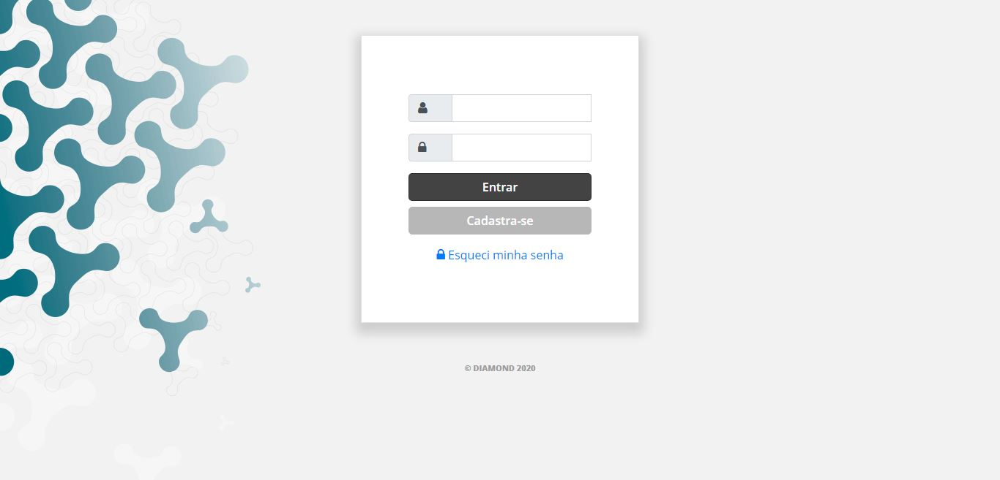
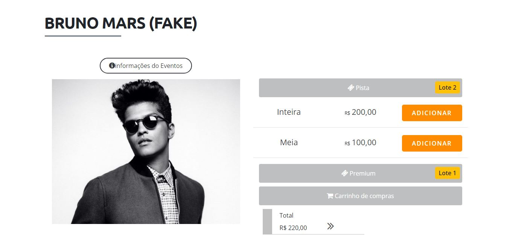
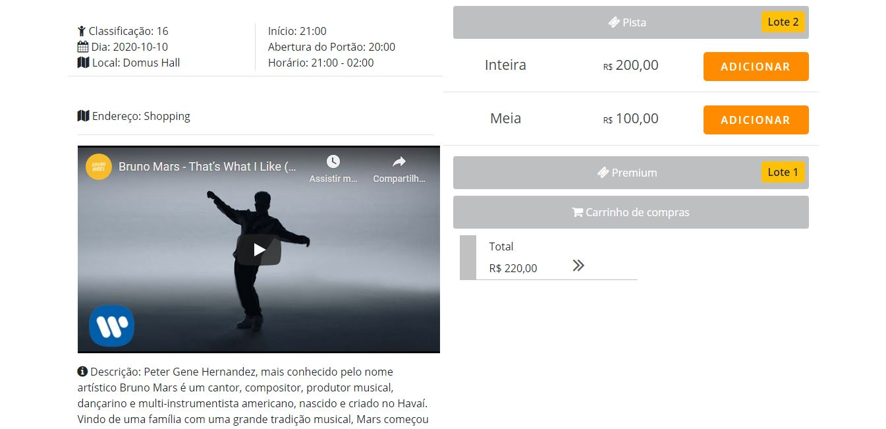
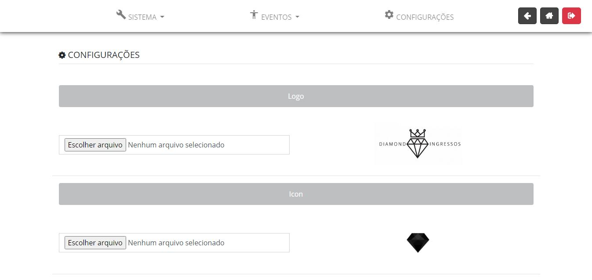
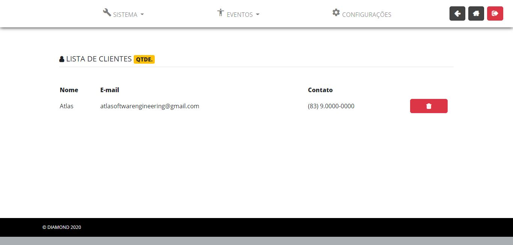
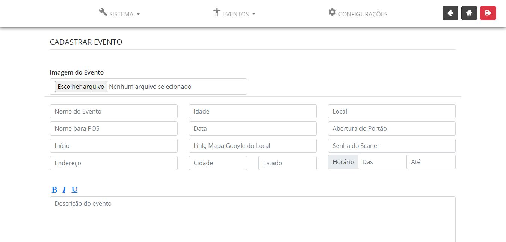
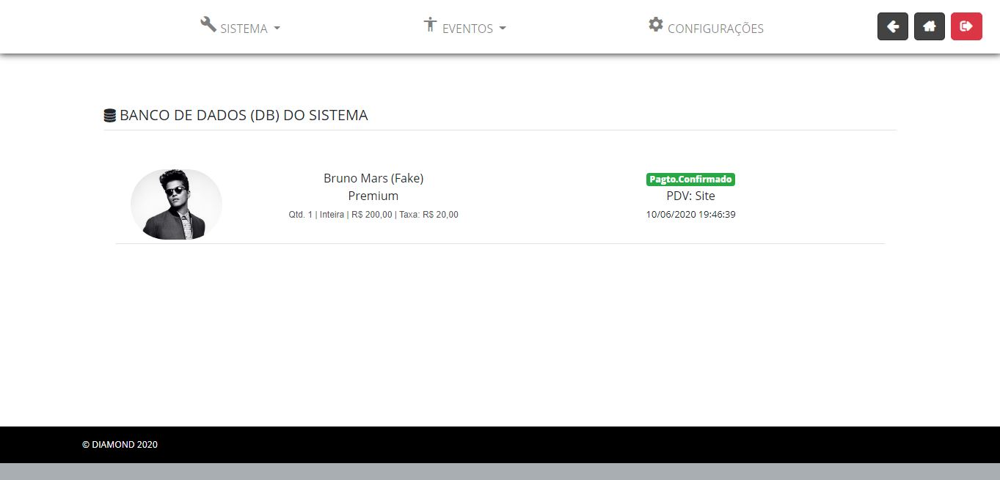

# Sistema de Vendas e Gestão de Ingressos

## Introdução

Com esse moderno sistema de vendas e gestão de ingressos, você poderá gerenciar suas vendas, anunciar novos enventos e ainda personalizar sua área de vendas através da área do administrador.

## ScreenShots

## License

The Laravel framework is open-sourced software licensed under the [MIT license](http://opensource.org/licenses/MIT).